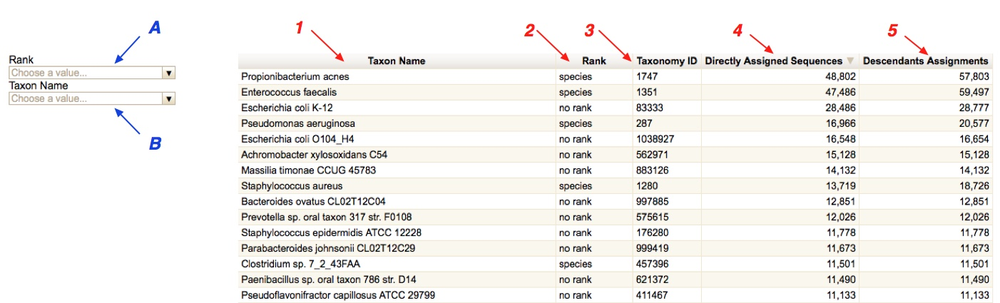

# **MetaShot (Metagemomics Shotgun)**

**MetaShot (Metagenomics Shotgun)** is a pipeline designed for the complete taxonomic assessment of the human microbiota.  
In MetaShot, third party tools and new developed Python and Bash scripts are integrated to analyze paired-end (PE) Illumina reads, offering an automated procedure covering all the analysis steps from raw data management to taxonomic profiling.  
MetaShot is designed to analyze both DNA-Seq and RNA-Seq data. 

1. [Pipeline description](#Pipeline-description) 
2. [Division data creation](#Division-data-creation)
3. [Install](#Install)  
    3.a [Requirements](#Requirements)  
    3.b [MetaShot setting up](#MetaShot-setting-up)  
4. [Usage](#Usage)  
    4.a [Taxonomic assignment](#Taxonomic-assignment)  
    4.b [Paired End (PE) reads extraction](#Paired-End-(PE)-reads-extraction)  
    4.c [Result files interpretation](#Result-files-interpretation)  
5. [References](#References)
    
## Pipeline description  
The MetaShot analysis procedure can be divided in four main processes:

  1. Pre-processing procedures: input sequences containing low-quality/complexity regions and reads shorter than 50 nucleotides are removed. This is performed by applying FaQCs [1]. Moreover, it removes the phage PhiX sequences. Only reads passing all the quality check filters are directed to the following steps.
  2. Comparison with the human genome: cleaned data are mapped against the human genome (hg19, GRCh37, 2009) [2] by applying STAR [3].
  3. Comparison with reference databases and taxonomic annotation: in MetaShot are implemented four reference collections for Prokaryotes, Viruses, Fungi and Protista, obtained by processing data from GenBank and RefSeq databases (for more information see the “Division data creation” section). The taxonomic annotation is a three step procedure: 
      * Identification of candidate microbial sequences: in order to reduce the processing time and the computational requirements, and to improve the assignment accuracy, the PE reads passing the denoising procedure are compared to the four reference collections, by applying Bowtie2 [4] with the default options (a compromise between speed and mapping accuracy). The mapping data are filtered and PE reads obtaining at least one match with a hamming distance [5] below 10% of the sequence length are retained. In this way MetaShot identifies a subset of reads to be addressed to the microbial taxonomic classification.
      * Comparison with reference databases and taxonomic annotation: microbial candidate sequences are compared to the four reference collections by using Bowtie2. In this step, the mapping accuracy is increased by modifying the length of seed substrings (-L option set to 20, the default value is 22) and the number of alignments per read (-k option set to 100, default 1). The resulting alignments are filtered according to identity percentage (threshold ≥ 97%) and query coverage (threshold ≥ 70%). The obtained results for the four different taxonomic divisions and for human genome and transcriptome are then intersected to remove the sequences that map ambiguously across them. Finally, the sequences are taxonomically annotated by using the TANGO (Taxonomic assignment in metagenomics) [^fn6] tool.
      * Human Endogenous Retrovirus (HERV) identification: in order to identify HERV sequences, the PE reads labeled as ambiguous are parsed to identify those mapping only to human genome and to the viral division. These PE reads are subsequently taxonomically annotated by applying TANGO on the mapping information obtained against the viral division. If the obtained classification is under the HERV group it is accepted, otherwise the PE will be considered ambiguous.
  4.	Report generation: a CSV file, an HTML interactive table summarizing the taxonomic assignment and a Krona graph [7] of the obtained taxonomy are provided for each division.


_**Figure1**: MetaShot workflow_
## Division data creation 
The reference collections for Prokaryotes, Viruses, Fungi and Protista have been built by following a common procedure, with some specific add-ons, implemented in a Bash and Python pipeline:
-	For each collection the GenBank and RefSeq flat-file and FASTA files were downloaded from the NCBI ftp site [ftp://ftp.ncbi.nlm.nih.gov](ftp://ftp.ncbi.nlm.nih.gov). For Prokaryotes and Viruses two specific GenBank divisions (BCT and VRL) are available. For Fungi, the “Plantae” GenBank division (PLN) was downloaded and the fungal entries were identified by parsing the taxonomic information of each entry. For Protista, the “Invertebrate” GenBank division (INV) was downloaded and the Protista entries were collected by suitably parsing the taxonomic information of each entry. Regarding the RefSeq data, specific divisions are available for Prokaryotes, Viruses and Fungi. As for GenBank data, the Prostista collection was created by downloading and parsing the “invertebrate” RefSeq division.
-	The entire NCBI taxonomy dump data were downloaded from the NCBI ftp site  [ftp://ftp.ncbi.nlm.nih.gov/pub/taxonomy/taxdump.tar.gz](ftp://ftp.ncbi.nlm.nih.gov/pub/taxonomy/taxdump.tar.gz). 
-	The Genbank flat-file was parsed in order to associate the accession number of each entry to a taxonomy identifier (taxid) in the NCBI taxonomy, by extracting the information annotated in the feature table “source” field. An entry was discarded if resulting associated to more than one microbial division or the associated taxid was not present in the reference taxonomy due to inconsistency between Genbank and Taxonomy databases. For the entries passing the taxonomy-based filter, the sequence data were annotated and the accession number – taxid association was stored in a dump.
-	FASTA sequences were indexed by applying the bowtie2-build program.
-	By using the dump containing the accession number – taxid association the TANGO reference taxonomy was built.
The current MetaShot reference collections were built starting from the releases 209 and 72 of the GenBank and RefSeq databases, respectively.

## Install 
### Requirements
MetaShot scripts use freely available Python packages and third party tools both requiring an installation performed by the users.
Actually, it requires a working Python 2.7 environment and the following modules:
 - NumPy: release 1.7.1 or superior [http://www.numpy.org](http://www.numpy.org)
 - BioPython: release 1.61 [http://biopython.org](http://biopython.org)
 - Pysam: 0.7.4 [http://pysam.readthedocs.io/en/stable/](http://pysam.readthedocs.io/en/stable/)
 - Psutil: release 3.3.0 [https://github.com/giampaolo/psutil](https://github.com/giampaolo/psutil)
 - ETE2: release 2.3.10 [http://etetoolkit.org/download/](http://etetoolkit.org/download/)
 
The following tools need to be installed on your machine:
 - Bowtie2: release2.2.3 [http://bowtie-bio.sourceforge.net/bowtie2/index.shtml](http://bowtie-bio.sourceforge.net/bowtie2/index.shtml)
 - STAR: release STAR_2.4.2a [https://github.com/alexdobin/STAR](https://github.com/alexdobin/STAR)
 - Krona Graph: release 2.6 [https://github.com/marbl/Krona/wiki](https://github.com/marbl/Krona/wiki)
 - FaQCs: release 2.08 [https://github.com/chienchi/FaQCs](https://github.com/chienchi/FaQCs): *please install it by using conda*: `conda install faqcs -c bioconda`
 - Samtools: release 0.1.18 [http://samtools.sourceforge.net](http://samtools.sourceforge.net)  

MetaShot requires at least 30 Gb of RAM to perform the entire analysis. Its reference collections require about 420Gb of free space on your storage system.  
To complete the analysis of 500 million PE reads it requires about 1.3 Tb.

### MetaShot setting up

#### Download the reference collections
All the reference collections, taxonomies and the other files needed for the MetaShot computation are stored in the compressed folder **MetaShot_reference_data.tar.gz**, freely available at [https://recascloud.ba.infn.it/index.php/s/9dFFTJUr0bOU2mN](https://recascloud.ba.infn.it/index.php/s/9dFFTJUr0bOU2mN) (the file is about 49 GB. Md5sum: 2def0475c8c3b49c15181de0c226b11a).  
To decompress the folder, type the following command in your terminal: `tar xvfz MetaShot_reference_data.tar.gz`  
The **MetaShot_reference_data** folder contains 9 subfolders:  
 - Bacteria (contains the data for all the Prokaryotes), Fungi, Protist and Virus folders contain the FASTA files to produce the bowtie indexes for each reference collection and the specific input data for taxonomic assignment.  
 In the “bowtie_index” subfolder a bash script is supplied to correctly format and name the bowtie-index.  
 For Prokaryotes, the reference collection is divided in 15 section, called “split”, each containing the bash script for bowtie2 index building;  
 To build the bowtie2 index type the following commands:
    ```
    chmod 755 build_index.sh 
    ./build_index.sh
    ```
 - Homo_sapiens: contains the hg19 release of human genome. Please follow the instructions available in the STAR guide;
 - Phix: contains the Phix genome. To build the bowtie2 index type the following commands:
    ```
    cd PhiX
    chmod 755 build_index.sh
    ./build_index.sh
    ```
 - krona_tax: contains the NCBI taxonomy pre-formatted needed for Krona graph production;
 - New_TANGO_perl_version. Contains the executable TANGO Perl scripts,
 - Metashot_reference_taxonomy: contains the taxonomy data.

#### Configure the Parameters File
In the MetaShot package, a textual file called “parameters_file.txt” is available that contains all the required information for the pipeline execution.  
The user must complete this file by adding the following information to the “General data” section:  
   1. Adding the complete path to the MetaShot package:  
    ```
    cd Metashot && pwd
    ```  
    Copy the result in correspondence of “script_path”, as in the following example: script_path : `/home/path/to/the/script_folder/`  
   2. Adding the complete path to the MetaShot_reference_data folder:    
    ```
    cd MetaShot_reference_data && pwd
    ```  
    Copy the result in correspondence of “reference_path”, as in the following example: reference_path : `/home/path/to/the/reference_folder/`  

## Usage
### Taxonomic assignment
The whole MetaShot analysis is performed by executing the __MetaShot_Master_script.py__ script.  
This script requires the following mandatory and optional parameters to launch the analysis process:
 - **-m** A text file containing the R1 and R2 PE reads file names, tab separated \[MANDATORY].  
    If a sample has been split in more flowcell lines, please insert in the file one line per each PE reads file.  
    Example: The sample1 has been sequenced in 3 flowcell lines. The read file content will be the following:  
   ``` 
    sample1_L001_R1.fastq sample1_L001_R2.fastq  
    sample1_L002_R1.fastq sample1_L002_R2.fastq  
    sample1_L003_R1.fastq sample1_L003_R2.fastq
   ```
 - **-p** Parameters files: a file containing all the information required for the MetaShot application \[MANDATORY]
 - **-e** Exclude the host mapping for the analysis of environmental samples
 - **-h** print this help

### Paired End (PE) reads extraction
Following the end of MetaShot analysis, the user could be interested in extracting specific PE reads.  
The __PE_extraction.py__ script can be used to extract the PE reads belonging to specific taxa in the NCBI taxonomy or to extract all the unassigned or ambiguous PE reads.  
This script requires as input a single NCBI taxonomy identifier or a list of NCBI taxonomy identifiers.  
Options:
 - **-t** NCBI taxonomy ID. To extract human sequences please use 9606
 - **-l** A text file containing a list of NCBI taxonomy ID, one per line
 - **-u** extract unassigned PE reads
 - **-a** extract ambiguous PE reads
 _ **-h** print this help

### Result files interpretation
MetaShot produces the following results:
 1. An HTML interactive table reporting for each node of the inferred taxonomy [Figure2](#Figure1):
    - the taxon name; 
    - the NCBI taxonomy ID; 
    - the number of PE reads assigned (Figure 1); 
  This interactive table are based on the Google API Code and requires a working internet connection. 
2. a CSV file containing the same information reported in the interactive table;
3. a Krona graph to graphically inspect the inferred microbiome. In particular, a Krona graph is produced for each division and a total one is produced to summarize the entire assignments. Information about the Krona graph is available following this [link](https://github.com/marbl/Krona/wiki).


_**Figure2**: an example of the interactive tables produced by MetaShot. In red are enumerated the field in common with the CSV file. In particular: (1) Taxon Name: the NCBI scientific name of the node; (2) Rank: the taxonomic rank of the node; (3) Taxonomy ID: the NCBI taxonomy identifier of the node; (4) Directly Assigned Sequences: number of PE reads directly assigned to the node; (5) Descendants Assignments: the number of PE reads assigned to the node and to its descendants (i.e. the first node is the species Propionibacterium acnes and MetaShot assigns directly to this node 48,802 and 9,001 to its descendants, so the fifth field in the line is equal to 57,803). In blue are listed the interactive fields to show the results on the basis of the NCBI taxonomic rank (A) or on a specific taxon name (B)._

# References
[1]:	Lo, C.C. and P.S. Chain, Rapid evaluation and quality control of next generation sequencing data with FaQCs. BMC Bioinformatics, 2014. 15: p. 366.  
[2]:	Rosenbloom, K.R., et al. The UCSC Genome Browser database: 2015 update. Nucleic Acids Res, 2015. 43(Database issue): p. D670-D681.  
[3]:	Dobin, A., et al., STAR: ultrafast universal RNA-seq aligner. Bioinformatics, 2013. 29(1): p. 15-21.  
[4]:	Sayers, E.W., et al., Database resources of the National Center for Biotechnology Information. Nucleic Acids Res, 2009. 37(Database issue): p. D5-15.  
[5]:	He, M.X., S.V. Petoukhov, and P.E. Ricci, Genetic code, hamming distance and stochastic matrices. Bull Math Biol, 2004. 66(5): p. 1405-21.  
[6]:	Alonso-Alemany, D., et al., Further Steps in TANGO: improved taxonomic assignment in metagenomics. Bioinformatics, 2014. 30(1): p. 17-23.  
[7]:	Ondov, B.D., N.H. Bergman, and A.M. Phillippy, Interactive metagenomic visualization in a Web browser. BMC Bioinformatics, 2011. 12: p. 385.  
